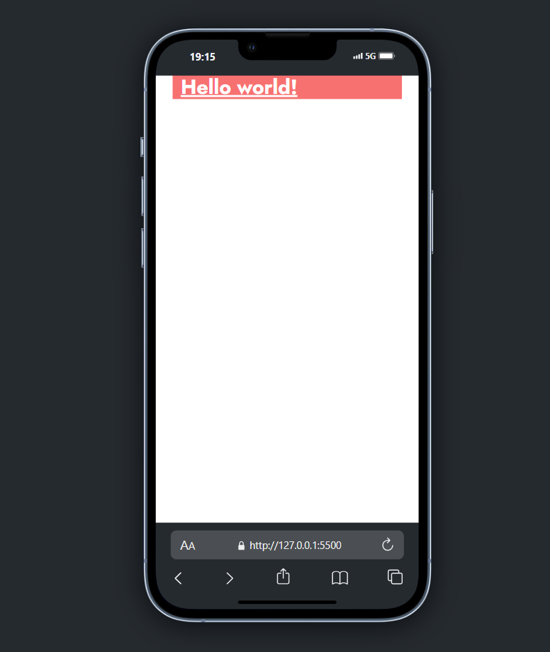
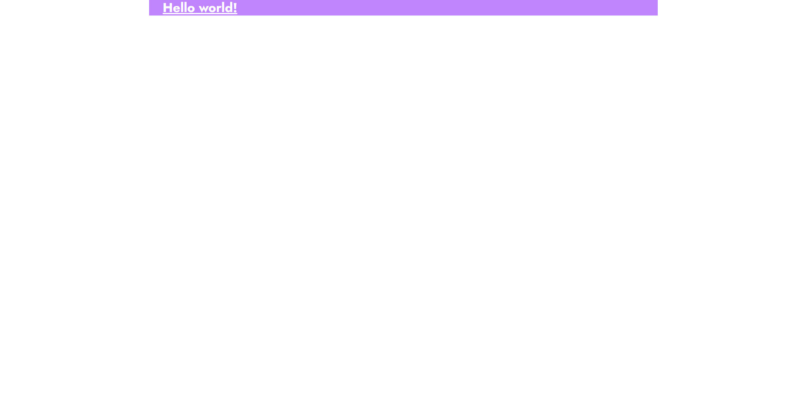

# Beautiful Garden Shop


### run project tailwind

```sh
npm run watch

```

and  _open with live server_ or "Alt+L Alt+O"


<!--  -->


<p align="center">

</p>

## Tumb Images


<a href="http://google.com/">Google</a>

<p float="center" align="center" style="margin: 5rem;">



</p>


<hr>

## Tailwind Installation
[TAILWINDCSS](https://tailwindcss.com/docs/installation)


## Fonts
[GOOGLE FONTS](https://fonts.google.com/selection/embed)


## Images

[PNGWING](https://www.pngwing.com/pt/search?q=png+gr%C3%A1tis)

[PNGEGG](https://www.pngegg.com/pt)

[PNGTREE](https://pt.pngtree.com/)

## ICONS

[REMIXICON](https://cdnjs.com/libraries/remixicon)

#

|author: |[IvanC_Code](https://github.com/ivandacruz)| :heart: |
|--------|--------------------------------------------|------------|